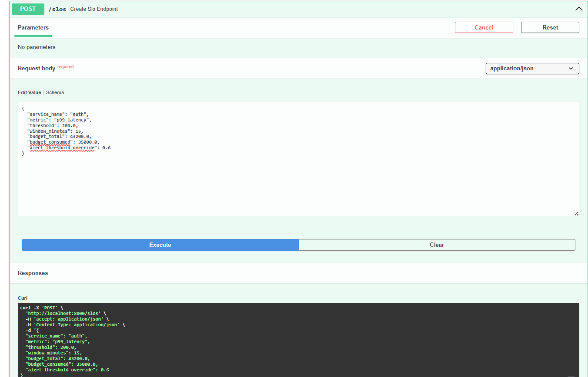
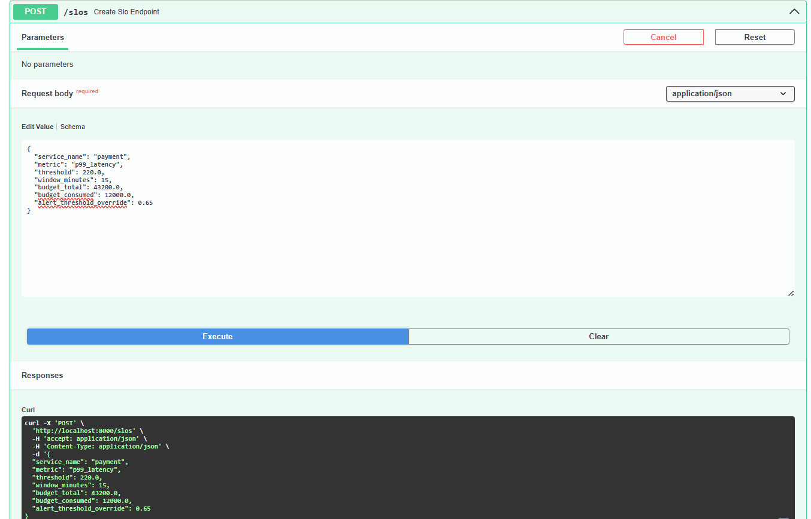
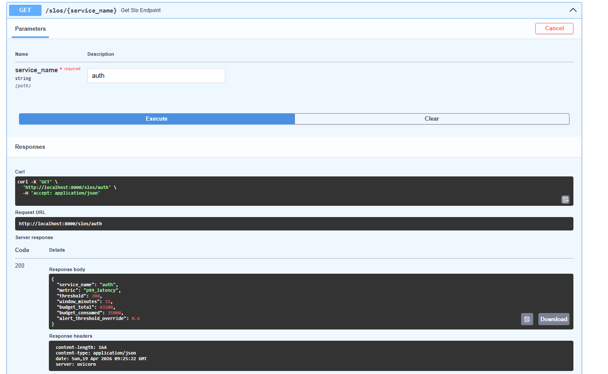
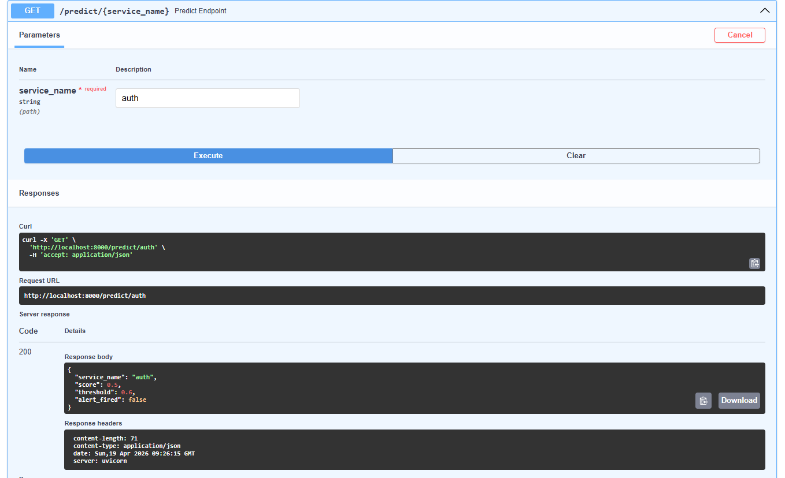
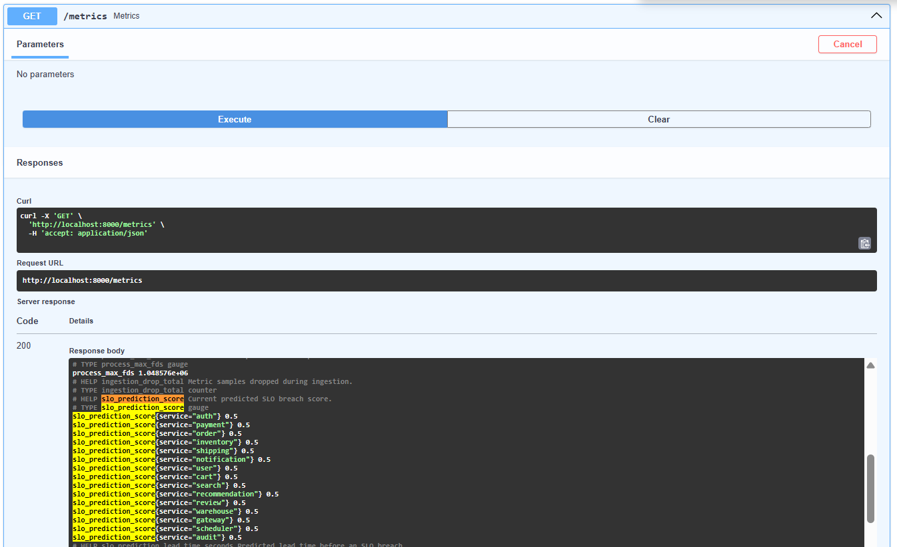
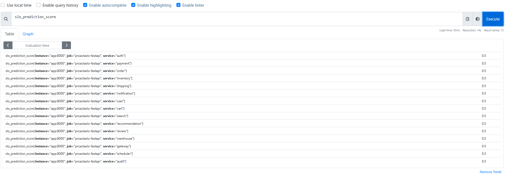
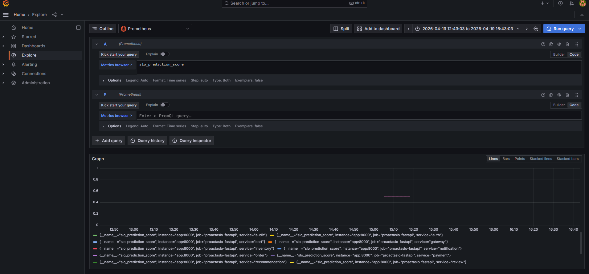
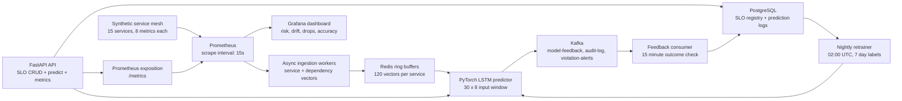

# ProactaSLO

ProactaSLO is a predictive SLO monitoring system for microservice platforms. It combines FastAPI, PostgreSQL, Redis, Kafka, Prometheus, Grafana, and a PyTorch LSTM model to estimate the probability of an upcoming SLO violation before the violation is visible as an alert.

The demo stack runs locally with Docker Compose and shows the full observability path: SLO definitions are created through Swagger, predictions are exposed as Prometheus metrics, Prometheus stores those metrics, and Grafana visualizes the prediction signal.

## Demo Evidence

### 1. Create an Auth SLO



The API creates an `auth` SLO with `p99_latency`, a `200 ms` threshold, a `15 minute` window, a monthly error budget of `43,200 minutes`, and an alert override of `0.6`.

### 2. Create a Payment SLO



The same registry path supports independent service-level policies. In this example, `payment` uses a `220 ms` `p99_latency` threshold and a `0.65` alert override.

### 3. Fetch the Auth SLO



The stored SLO is retrieved from the PostgreSQL-backed SLO registry through `GET /slos/{service_name}`.

### 4. Predict Auth SLO Risk



The prediction endpoint returns a score of `0.5`, an effective threshold of `0.6`, and `alert_fired=false`. This is expected in the fresh demo path because no trained checkpoint exists yet, so the system returns a neutral fallback score while still exercising the API, cache, Kafka publish path, database logging, and metrics export.

### 5. Expose Prediction Metrics



The FastAPI `/metrics` endpoint exposes `slo_prediction_score` for all 15 services. These values are Prometheus-compatible and are scraped by the Prometheus container.

### 6. Query Metrics in Prometheus



Prometheus shows one time series per service for `slo_prediction_score`. In the fresh demo run, each service emits a neutral value of `0.5`.

### 7. Visualize in Grafana



Grafana Explore reads the same `slo_prediction_score` series from Prometheus, proving the observability chain from FastAPI to Prometheus to Grafana.

## Architecture



## System Layers

| Layer | Role | Implementation |
| --- | --- | --- |
| API layer | Exposes SLO CRUD, prediction, health, and metrics endpoints | FastAPI on port `8000` |
| SLO registry | Stores SLO definitions, budgets, thresholds, and prediction logs | PostgreSQL with SQLAlchemy async and asyncpg |
| Ingestion layer | Pulls service telemetry and dependency telemetry from Prometheus | One async coroutine per service |
| Cache layer | Stores recent normalized vectors, prediction TTLs, and scaler state | Redis lists and keys |
| ML layer | Predicts probability of future SLO violation | PyTorch LSTM |
| Alerting layer | Publishes prediction, audit, and violation events | Kafka topics |
| Feedback layer | Labels predictions after a 15 minute observation window | Kafka consumer + Prometheus query_range |
| Retraining layer | Rebuilds models from labelled prediction history | APScheduler at `02:00 UTC` |
| Observability layer | Tracks prediction scores, drops, drift, lead time, and accuracy | Prometheus + Grafana |

## Numeric Design Choices

| Design point | Value | Why it matters |
| --- | ---: | --- |
| Services modeled | `15` | Covers a realistic mesh: auth, payment, order, inventory, shipping, notification, user, cart, search, recommendation, review, warehouse, gateway, scheduler, audit |
| Metrics per service | `8` | Latency, error, traffic, saturation, and queue health |
| Scrape interval | `15 seconds` | Fast enough for near-real-time risk changes without overloading the demo stack |
| Redis ring buffer | `120 vectors` | Keeps the latest `30 minutes` of samples per service at 15 second intervals |
| LSTM input window | `30 x 8` | The model sees 30 recent timesteps of 8 primary service metrics |
| Prediction cache TTL | `30 seconds` | Avoids repeated model inference for the same service during dashboard refreshes |
| Feedback window | `15 minutes` | Gives enough time to verify whether a predicted violation actually occurred |
| Default alert threshold | `0.75` | Conservative default to reduce noisy alerts |
| Budget pressure override | `0.6` in demo | More sensitive alerting once error budget consumption exceeds 80 percent |
| Monthly error budget example | `43,200 minutes` | Represents a 30 day SLO accounting window |
| Retraining cadence | Nightly at `02:00 UTC` | Keeps model updates predictable and off the hot path |

## Metrics Modeled

Each service emits or consumes these eight metric signals:

| Metric | Meaning |
| --- | --- |
| `p50_latency` | Median request latency |
| `p95_latency` | Tail latency pressure |
| `p99_latency` | SLO-critical latency signal |
| `error_rate` | Failed request ratio |
| `request_rate` | Traffic volume |
| `cpu_util` | CPU saturation |
| `memory_usage` | Memory pressure |
| `queue_depth` | Backlog and queuing risk |

## ML Layer

The predictor is a two-layer LSTM:

```text
Input shape:   (batch_size, 30, 8)
LSTM layers:   2
Hidden size:   64
Dropout:       0.2
Output:        sigmoid probability in [0, 1]
```

The model reads the last 30 normalized metric vectors for a service and returns a violation probability. The fresh demo run intentionally returns `0.5` when no checkpoint exists in `models/`. That keeps the system safe and observable before retraining data is available.

## Architecture Tradeoffs

| Choice | Benefit | Tradeoff |
| --- | --- | --- |
| Redis ring buffers for metric vectors | Fast reads for inference and simple bounded memory | Recent history is optimized for hot-path inference, not long-term analytics |
| PostgreSQL for SLOs and prediction logs | Durable source of truth for policies and feedback labels | Slower than Redis, so it is not used for every metric sample |
| Kafka for prediction feedback and alerts | Decouples API latency from downstream consumers | Adds operational complexity with broker and topic management |
| Prometheus query API for ingestion | Reuses standard observability data instead of custom collectors | Ingestion depends on Prometheus availability and scrape freshness |
| LSTM over rule-only thresholds | Captures temporal patterns and leading indicators | Requires labelled feedback and model checkpoints to outperform neutral fallback |
| 30 second prediction TTL | Reduces duplicate inference during dashboard refreshes | Very short-lived spikes may be cached for up to 30 seconds |
| 15 minute outcome window | Matches practical SLO alert validation windows | Feedback labels are delayed by design |

## Local Run

Start the full stack:

```powershell
docker compose up --build -d
```

Check containers:

```powershell
docker compose ps
```

Stop the stack:

```powershell
docker compose down
```

## Local URLs

| Tool | URL | Purpose |
| --- | --- | --- |
| FastAPI Swagger | `http://localhost:8000/docs` | Test SLO and prediction APIs |
| FastAPI metrics | `http://localhost:8000/metrics` | Prometheus exposition format |
| Prometheus | `http://localhost:9090` | Query and inspect scraped metrics |
| Grafana | `http://localhost:3000` | Visualize prediction metrics |

Grafana credentials:

```text
admin / admin
```

## Demo API Calls

Create an SLO:

```json
{
  "service_name": "auth",
  "metric": "p99_latency",
  "threshold": 200.0,
  "window_minutes": 15,
  "budget_total": 43200.0,
  "budget_consumed": 35000.0,
  "alert_threshold_override": 0.6
}
```

Fetch the SLO:

```text
GET /slos/auth
```

Run a prediction:

```text
GET /predict/auth
```

Fresh demo response:

```json
{
  "service_name": "auth",
  "score": 0.5,
  "threshold": 0.6,
  "alert_fired": false
}
```

## Prometheus Queries

Useful queries for validation:

```promql
slo_prediction_score
```

```promql
ingestion_drop_total
```

```promql
model_drift_signal
```

```promql
prediction_accuracy
```

```promql
slo_alert_fired_total
```

## Synthetic Mesh

The synthetic mesh can simulate 15 microservices on ports `8001-8015`:

| Service | Port |
| --- | ---: |
| auth | 8001 |
| payment | 8002 |
| order | 8003 |
| inventory | 8004 |
| shipping | 8005 |
| notification | 8006 |
| user | 8007 |
| cart | 8008 |
| search | 8009 |
| recommendation | 8010 |
| review | 8011 |
| warehouse | 8012 |
| gateway | 8013 |
| scheduler | 8014 |
| audit | 8015 |

Run locally:

```powershell
python scripts\synthetic_mesh.py
```

Each service exposes Prometheus text metrics at:

```text
http://localhost:<port>/metrics
```

Violation injection behavior:

| Event | Value |
| --- | ---: |
| Injection interval | random `7200-14400 seconds` |
| Violation duration | random `600-1200 seconds` |
| Normal p99 latency | mean `200 ms`, std `20 ms` |
| Violation p99 latency | mean `600 ms`, std `50 ms` |
| Gateway cascade p99 latency | mean `400 ms`, std `40 ms` for auth, payment, and order |
| Normal error rate | mean `0.001`, std `0.0002` |
| Violation error rate | mean `0.05`, std `0.005` |

## Repository Structure

```text
proactaslo/
├── docker-compose.yml
├── prometheus.yml
├── requirements.txt
├── .env.example
├── app/
│   ├── main.py
│   ├── config.py
│   ├── slo_registry.py
│   ├── metric_ingestion.py
│   ├── prediction_engine.py
│   ├── alert_publisher.py
│   ├── feedback_consumer.py
│   ├── retrainer.py
│   ├── cache.py
│   └── observability.py
├── models/
├── grafana/
│   └── dashboard.json
├── scripts/
│   └── synthetic_mesh.py
└── docs/
    └── screenshots/
```

## What the Current Demo Proves

The captured run proves:

- The full Docker stack builds and starts.
- SLOs can be created and retrieved through the API.
- Predictions can be requested for a service.
- Prediction scores are exported through `/metrics`.
- Prometheus scrapes `slo_prediction_score`.
- Grafana can query the same Prometheus-backed metric.

The current screenshot set intentionally shows the neutral no-checkpoint path. In a production or extended demo run, labelled feedback rows and nightly retraining create `models/{service}.pt` checkpoints, after which the prediction score becomes model-driven rather than neutral.
