# ProactaSLO

ProactaSLO is a predictive SLO monitoring system for microservice platforms. It combines FastAPI, PostgreSQL, Redis, Kafka, Prometheus, Grafana, and a PyTorch LSTM model to estimate the probability of an upcoming SLO violation before the violation is visible as an alert.

The demo stack runs locally with Docker Compose and shows the full observability path: SLO definitions are created through Swagger, predictions are exposed as Prometheus metrics, Prometheus stores those metrics, and Grafana visualizes the prediction signal.

## Demo Evidence

### 1. Create an Auth SLO


The API creates an `auth` SLO with `p99_latency`, a `200 ms` threshold, a `15 minute` window, a monthly error budget of `43,200 minutes`, and an alert override of `0.6`.

### 2. Create a Payment SLO


The same registry path supports independent service-level policies. In this example, `payment` uses a `220 ms` `p99_latency` threshold and a `0.65` alert override.

### 3. Fetch the Auth SLO


The stored SLO is retrieved from the PostgreSQL-backed SLO registry through `GET /slos/{service_name}`.

### 4. Predict Auth SLO Risk


The prediction endpoint returns a score of `0.5`, an effective threshold of `0.6`, and `alert_fired=false`. This is expected in the fresh demo path because no trained checkpoint exists yet, so the system returns a neutral fallback score while still exercising the API, cache, Kafka publish path, database logging, and metrics export.

### 5. Expose Prediction Metrics


The FastAPI `/metrics` endpoint exposes `slo_prediction_score` for all 15 services. These values are Prometheus-compatible and are scraped by the Prometheus container.

### 6. Query Metrics in Prometheus


Prometheus shows one time series per service for `slo_prediction_score`. In the fresh demo run, each service emits a neutral value of `0.5`.

### 7. Visualize in Grafana


Grafana Explore reads the same `slo_prediction_score` series from Prometheus, proving the observability chain from FastAPI to Prometheus to Grafana.

## Architecture Diagram



The architecture follows a metrics-first pipeline: synthetic or real service telemetry is scraped by Prometheus, normalized and buffered in Redis, scored by an LSTM-based prediction layer, logged in PostgreSQL, published through Kafka, and visualized through Prometheus and Grafana.

## System Layers

| Layer | Role | Implementation |
| --- | --- | --- |
| API layer | Exposes SLO CRUD, prediction, health, and metrics endpoints | FastAPI on port `8000` |
| SLO registry | Stores SLO definitions, budgets, thresholds, and prediction logs | PostgreSQL with SQLAlchemy async and asyncpg |
| Ingestion layer | Pulls service telemetry and dependency telemetry from Prometheus | One async coroutine per service |
| Cache layer | Stores recent normalized vectors, prediction TTLs, and scaler state | Redis lists and keys |
| ML layer | Predicts probability of future SLO violation | PyTorch LSTM |
| Alerting layer | Publishes prediction, audit, and violation events | Kafka topics |
| Feedback layer | Labels predictions after a 15 minute observation window | Kafka consumer plus Prometheus `query_range` |
| Retraining layer | Rebuilds models from labelled prediction history | APScheduler at `02:00 UTC` |
| Observability layer | Tracks prediction scores, drops, drift, lead time, and accuracy | Prometheus plus Grafana |

## Numeric Design Choices

| Design point | Value | Why it matters |
| --- | ---: | --- |
| Services modeled | `15` | Covers a realistic mesh: auth, payment, order, inventory, shipping, notification, user, cart, search, recommendation, review, warehouse, gateway, scheduler, audit |
| Metrics per service | `8` | Latency, error, traffic, saturation, and queue health |
| Scrape interval | `15 seconds` | Fast enough for near-real-time risk changes without overloading the demo stack |
| Redis ring buffer | `120 vectors` | Keeps the latest `30 minutes` of samples per service at 15 second intervals |
| LSTM input window | `30 x 8` | The model sees 30 recent timesteps of 8 primary service metrics |
| Prediction cache TTL | `30 seconds` | Avoids repeated model inference for the same service during dashboard refreshes |
| Feedback window | `15 minutes` | Gives enough time to verify whether a predicted violation actually occurred |
| Default alert threshold | `0.75` | Conservative default to reduce noisy alerts |
| Budget pressure override | `0.6` in demo | More sensitive alerting once error budget consumption exceeds 80 percent |
| Monthly error budget example | `43,200 minutes` | Represents a 30 day SLO accounting window |
| Retraining cadence | Nightly at `02:00 UTC` | Keeps model updates predictable and off the hot path |

## Metrics Modeled

Each service emits or consumes these eight metric signals:

| Metric | Meaning |
| --- | --- |
| `p50_latency` | Median request latency |
| `p95_latency` | Tail latency pressure |
| `p99_latency` | SLO-critical latency signal |
| `error_rate` | Failed request ratio |
| `request_rate` | Traffic volume |
| `cpu_util` | CPU saturation |
| `memory_usage` | Memory pressure |
| `queue_depth` | Backlog and queuing risk |

## ML Layer

The predictor is a two-layer LSTM:

```text
Input shape:   (batch_size, 30, 8)
LSTM layers:   2
Hidden size:   64
Dropout:       0.2
Output:        sigmoid probability in [0, 1]

